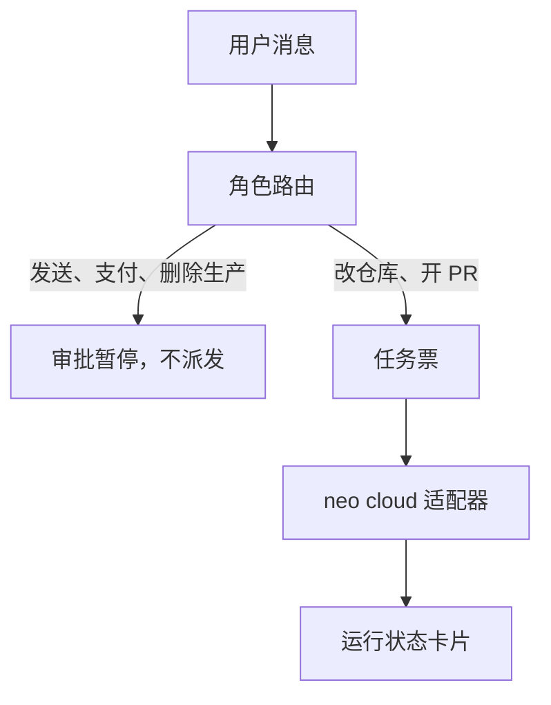

# 架构说明

这份说明综合了 2026-10-06 对 Grok Bot、xAI API、开源 agent 运行时，以及 neo cloud agent 公开契约的核对。展出代码已经按这个切分落在本仓库。

## Overview

neo-personal-bot 是用户自己的、可改角色的工作团队。人用消息把工作派给具名队友；路由进程只识别角色、意图和风险，把可执行工作写成内部任务票，再交给云端 agent。主执行适配器是公开产品 [neo-cloud-agent](https://github.com/Neo2Agent/neo-cloud-agent)。Cursor Cloud Agents v1 是第二适配器，使用另一套请求类型。

产品形态对照 [Grok Bot](https://docs.x.ai/grok-bot/overview)（2026-10-06 核对）。它随付费 Cursor 方案提供，或通过绑定的 SuperGrok 提供。每个用户有一台持久云电脑，跑在 Cursor 的云里，上面是多名具名队友。队友共享文件、浏览器会话和登录态；隔离在用户与用户之间。消息是界面。队友有 skills 和 routines。多个 bot 可以并行，各自一块屏幕，每块屏幕同时只有一个 computer-use 任务。记忆是稳定偏好、角色上下文和摘要；会影响结论的事实要回到源头再核对。笔记本合上，云上的工作继续。

这套形态由 neo-personal-bot 自己实现控制面。xAI 公开的是模型 API，没有 Grok Bot CRUD。`github.com/Neo2Agent/neo-cloud-agent` 与 kaibairen 在公开 git 历史上没有从属关系，按第三方 API 集成。同一账号的 `cursor_browser_apk` 已经调用过 `POST https://api.cursor.com/v1/agents`，只作为 Cursor 客户端参考。

展出是一条可运行故事，外加与之对齐的 PRD。定义两个角色：研究员、工程师。用户 `@工程师`，要求改一个仓库并开 PR。Bot 建立任务票，派发到 neo cloud agent，回一张卡片，上面是状态、分支、PR 或错误。要求发送、支付或删除生产的消息停在审批，不派发。

## Key Concepts

**角色。** 角色是用户可编辑的队友定义：职责、可接触的仓库、输出习惯。它不是操作系统用户，也不是云上的安全主体。第一周的「记忆」就是角色职责本身，写在 `roles.py`。Mem0、Letta、Graphiti 不进第一周。

**消息。** 消息是产品界面。展出通道是 CLI 和本机网页。下一条通道是飞书（`larksuite/oapi-sdk-python`）或 Telegram 的 aiogram。不采用 GPL 的 python-telegram-bot。

**任务票。** 路由和云 API 之间只有内部任务票（`TaskTicket`）。票上是角色、仓库、任务说明、是否要 PR、选定的执行后端。Neo 的 `CreateRunRequest` 与 Cursor 的创建请求是两套函数，不共用一个 dict。

**neo-cloud-agent 的 Run。** 创建请求包含 `prompt`、`repoUrls[]`，以及可选的 `ref`、`expertId`、`source`、`mode`（`agent` 或 `ask`）。状态为 `NOT_YET_STARTED`、`PROVISIONING`、`INSTALLING`、`RUNNING`、`IDLE`、`WAITING_FOR_BACKGROUND_WORK`、`ERROR`、`ARCHIVED`、`EXPIRED`。PR 在 `Run.pullRequests`，分支在 `Run.branchName`。追问使用同一个 run id。`expertId` 只在角色上显式绑定时才发送。公开契约来自该仓库的 `packages/contracts/src/run.ts` 与控制面 `POST /v1/runs`（成功 `201`，缺 `prompt` 为 `400`）。

**Cursor Cloud Agents v1。** `POST https://api.cursor.com/v1/agents` 的体是 `prompt.text`、可选 `repos`、`autoCreatePR`。Agent id 形如 `bc-...`。Run 是另一个对象。追问会新开一个 run。Agent 忙时返回 `409 agent_busy`。错误可以让 agent 仍为 `IDLE`，而 run 为 `ERROR`。v1 webhook 尚未提供。文档：<https://cursor.com/docs/cloud-agent/api/endpoints>。

**模型 API。** 纯推理走 `https://api.x.ai/v1` 的 Responses API，与 OpenAI SDK 兼容。内置工具在服务端，自定义函数在客户端。旗舰模型是 `grok-4.7`。这不是 Bot 编排接口，展出路径不调用它。

**审批。** 发送、支付、购买、删除生产是后果动作。命中后任务票停在待审批，适配器不被调用。

**执行位置。** 路由不执行 shell。改仓库发生在云 agent 的机器上。

## How It Works

展出路径只走 neo-cloud-agent 的字段。没有令牌时用录像适配器回放同一条状态序列。Cursor 适配器实现同一张内部票，不出现在默认故事里。

1. CLI 或 `POST /messages` 读入消息。`@工程师` 绑定工程师，`@研究员` 绑定研究员。
2. `router.py` 分类，不起子进程。命中审批词时写入待审批记录，回复暂停原因，结束。此时没有创建 run。
3. 可执行消息变成 `TaskTicket`。工程师改仓库并开 PR 时，票里有目标 `repo_urls`、任务说明、`want_pr`。
4. Neo 适配器把票映射成 `CreateRunRequest` 并创建 run。之后在同一次请求里轮询，直到终态或次数用尽。生产应把这一步放进 jobs 表，用 Postgres `SKIP LOCKED` 领取。展出用 SQLite 把卡片记下来，单进程顺序跑完。
5. 状态卡片使用内部字段：当前状态、分支、PR，或错误。`PROVISIONING` 和 `INSTALLING` 显示为进行中。`IDLE` 表示这一轮可以收束。`WAITING_FOR_BACKGROUND_WORK` 表示云上还有后台工作，不算交付。
6. 对同一件事追问时，Neo 路径应把后续 prompt 送到同一个 run id（`POST /v1/runs/{id}/follow-ups`）。这一步还没做进展出。改走 Cursor 时新开 run，并单独处理 `409 agent_busy`。

PRD 与 CLI、网页使用同一条故事。

技术栈沿这条链摆放：Python 3.12、FastAPI、Pydantic、httpx。网页和 CLI 调用同一个 `handle_message`。开源项目只借鉴渠道、任务状态和进程边界：OpenClaw、nanobot、hermes-agent、paperclip。不 fork Dify 或 FastGPT。Daytona 开源仓库已归档，不作为运行时。云电脑由 neo-cloud-agent 提供，不在这个仓库里再做一台。

## Where Things Live

| 位置 | 内容 |
| --- | --- |
| `docs/prd.md` | 与展出同一条故事的产品说明 |
| `docs/research.md` | Grok Bot、Grok API、开源方案与选型 |
| `src/neo_personal_bot/roles.py` | 研究员与工程师 |
| `src/neo_personal_bot/router.py` | 消息到角色、审批、任务票。这里没有 shell |
| `src/neo_personal_bot/tickets.py` | 内部任务票、外部引用、终态集合 |
| `src/neo_personal_bot/adapters/neo.py` | 只认识 `/v1/runs` |
| `src/neo_personal_bot/adapters/cursor.py` | 只认识 `/v1/agents` 与 run |
| `src/neo_personal_bot/adapters/fixture.py` | 无凭证时的状态录像 |
| `src/neo_personal_bot/service.py` | 先路由，再派发，再收成卡片 |
| `src/neo_personal_bot/cli.py` | 命令行展出 |
| `src/neo_personal_bot/api.py` 与 `exhibit.html` | 网页展出 |
| `src/neo_personal_bot/jobs.py` | SQLite 记录。生产换成 Postgres 队列 |

外部系统：

| 位置 | 内容 |
| --- | --- |
| `https://docs.x.ai/grok-bot/overview` | Grok Bot 产品定义 |
| `https://api.x.ai/v1` | Responses API。无 Bot CRUD |
| `https://github.com/Neo2Agent/neo-cloud-agent` | 主执行后端 |
| `https://cursor.com/docs/cloud-agent/api/endpoints` | 第二执行后端 |
| `https://github.com/kaibairen/cursor_browser_apk` | 已有的 Cursor API 客户端 |

## Gotchas

**共享电脑不是安全边界。** Grok Bot 的隔离在用户之间。同一用户的队友共享文件、浏览器会话和登录态。neo-personal-bot 的角色同样处在该用户的信任域里。发送、支付、删除生产靠审批截断派发。

**两套云契约必须分开。** Neo 的追问是同一个 run id。Cursor 的追问是新 run，忙则 `409 agent_busy`。Cursor 的 agent 可以是 `IDLE`，对应 run 已经是 `ERROR`，不能用 agent 状态代替 run 状态。Neo 的 PR 与分支在 Run 上；Cursor 用 `autoCreatePR` 和 run 上的 `git.branches[]`。v1 webhook 尚未提供，两边都先轮询。两家字段放进同一个请求类型后，换后端和排错都会串状态。

**Grok 的四条产品线不能并成一个多 Agent。** Grok Bot 是 Cursor 云上的具名队友和持久电脑。与它分开的是：grok.com 聊天、X 上的 @grok、Grok Build 的成百上千个一次性工人、API 上的 `grok-4.20-multi-agent`。Bot 没有公开 CRUD。调模型用 Responses API 和 `grok-4.7`。这四条都不代替对 neo-cloud-agent 的派发。

**状态字按枚举解释。** `NOT_YET_STARTED`、`PROVISIONING`、`INSTALLING`、`RUNNING`、`WAITING_FOR_BACKGROUND_WORK` 仍在工作。`ARCHIVED` 与 `EXPIRED` 是结束，与 `ERROR` 不同。

**审批之前适配器零调用。** 已有审批记录也不触发静默重试。

**第一周不换执行底座。** 不自建云电脑，不使用已归档的 Daytona 开源仓库，不整栈搬入 Dify 或 FastGPT。

**「删除」这个字本身不触发审批。** 词表里是「删库」「删除生产」「删除账号」「删除仓库」。否则「删掉 README 的一行」会被误伤。这是刻意的窄规则。
