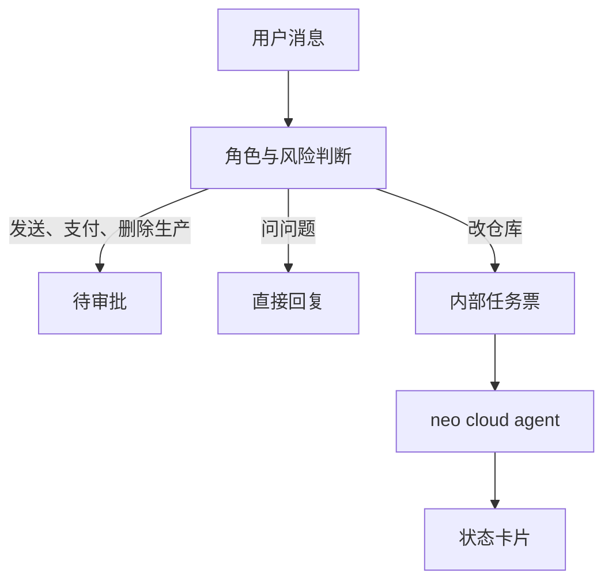

# neo-personal-bot 产品选型与技术设计

核对日期：2026-10-06。价格、限额和仓库状态会变，以当天页面为准。没有打开的页面写成缺口。

这份文件回答四件事：Grok Bot 怎么设计、它公开的技术栈是什么、neo-personal-bot 选什么、以及怎样和 neo cloud agent 联动。实现顺序写在最后，本阶段的交付物是这份方案和 [PRD](prd.md)。

## 1. 选型结论

| 决定 | 选择 |
| --- | --- |
| 产品参照 | Grok Bot：命名队友、消息即界面、电脑在云上、对外动作给人批 |
| 我们做的一层 | 个人团队的控制面：角色、意图、审批、任务票、状态卡片 |
| 主执行面 | [Neo2Agent/neo-cloud-agent](https://github.com/Neo2Agent/neo-cloud-agent)，`POST /v1/runs` |
| 备选执行面 | Cursor Cloud Agents API v1，`POST /v1/agents`。与 Neo 分两套请求 |
| 模型 | 控制面先用规则分类。需要推理时再接 OpenAI 兼容 HTTP，可指向 `https://api.x.ai/v1` 的 `grok-4.7` |
| 控制面语言 | Python 3.12。渠道侧能接飞书官方 SDK，路由侧以后能接 Pydantic AI |
| 存储 | Postgres。任务表用 `SKIP LOCKED` 领取。演示阶段也不引入 Redis |
| 开源 | 借鉴 OpenClaw、nanobot、Hermes、Paperclip 的边界。不 fork 它们，也不 fork Dify / FastGPT |
| 本阶段交付 | PRD + 本方案 + 下面的示例报文。运行时等方案评审后再写 |

Grok API 提供模型、搜索、沙箱代码和函数协议。它不提供命名队友、审批和云电脑。Grok Bot 的客户端有这些产品能力，但没有公开的 Bot 管理 API。所以团队产品要自己做控制面，把执行交给已有的 cloud agent。

## 2. Grok Bot 的设计方式

公开文档把 Grok 拆成多条产品线。和「个人化可自定义工作团队」对齐的是 Grok Bot。

| 产品 | 交互单位 | 和我们的关系 |
| --- | --- | --- |
| grok.com / iOS / Android | 一条多轮对话 | 一个助手。多 agent 是并行查完再合成一条带引用的回答 |
| Grok on X | 社交产品里的 Grok | 2026-10-06 没有打开 X 帮助中心。工作单位不放在这里 |
| `https://api.x.ai/v1` | 一次 Responses 请求 | 模型与工具 |
| Voice / Voice Agent Builder | 一段语音或一通电话 | 渠道 |
| Grok Build | 终端会话，或一份 workflow 报告 | 大量一次性工人，跑完就散 |
| Grok Bot | 给一个命名 Bot 发消息 | 少数有职责的队友，共用该用户的一台云电脑 |

来源：<https://docs.x.ai/grok/overview>、<https://docs.x.ai/grok-bot/overview>、<https://docs.x.ai/llms.txt>、<https://docs.x.ai/developers/model-capabilities/text/multi-agent>、<https://x.ai/news/workflows>。

2026-10-06 的 [Grok Bot overview](https://docs.x.ai/grok-bot/overview) 写明这些设计：

- 每个 Bot 有名字和职责。消息就是界面，可以打字、听写或语音。
- Bot 跑在一台持久云电脑上，有浏览器、文件系统和终端。电脑在 Cursor 的云里。笔记本合上，工作继续。
- 套餐覆盖付费个人 Cursor 计划、Cursor Teams，或绑定的个人 SuperGrok / Plus / Heavy。用量按周重置。
- 该用户的所有 Bot 共用这台电脑的文件、浏览器会话和应用登录。隔离在用户与用户之间。放上电脑的东西，每个 Bot 都能碰到。
- 多个 Bot 可以并行。每个 Bot 一块屏幕，同一块屏幕上同时只有一个 computer-use 任务。
- Bot 会互相发消息、在群里交接。
- 走一遍操作可以存成 skill，再按日程重跑。
- 记忆是稳定偏好、角色上下文和先前工作的摘要。会影响结论的事实要回源核对。
- 站点挡住自动化、会话过期或需要人的步骤时，Bot 把步骤交回给人。

编码还可以再委派给另一台 Cursor Cloud Agent，做完把文件抄回对话。控制面是队友对话，执行面是另一台电脑。这是我们要沿用的切分。

沿用：一角色一职；职责和当次任务分开写；交接需要被人看见时才拉群；对外动作先停；交付物分成事实、推断、已做、待批、未核实。

改掉：全角色共用登录态。Grok 写明这不是安全边界。个人团队若角色权限不同，凭证要按角色隔离，第一版则先用审批挡住发送、付款和删除生产。日常编制保持少数命名角色。Grok Build 那种成百上千个匿名工人，以及 API 里一次研究请求的 `grok-4.20-multi-agent`，都留给大范围检索，不充当「我的研究员 / 工程师」。

Grok Bot 没有公开的创建、发消息、管电脑的 REST。文档站上这组页面是客户端说明。

## 3. Grok 公开的技术栈

文档站自称为 SpaceXAI（xAI），地址仍是 `https://docs.x.ai/`。

| 层 | 公开方案 |
| --- | --- |
| 推理 | `https://api.x.ai/v1`，`Authorization: Bearer` |
| 推荐 API | Responses API。OpenAI SDK 把 `base_url` 指到这里。Chat Completions 被标为 Deprecated |
| 客户端 | `xai-sdk`、Vercel AI SDK `@ai-sdk/xai`、LiteLLM `xai/grok-4.7` |
| 旗舰文本 | `grok-4.7`。定价页在 200k prompt 以下约为输入 $2、缓存 $0.50、输出 $6 / 1M tokens；达到阈值后整次请求按高价。以 <https://docs.x.ai/developers/pricing> 为准 |
| 工具 | 网页搜索、X 搜索、代码执行、Collections、出图、远程 MCP 在服务端闭环。自定义函数把 `function_call` 交回调用方 |
| 语音 | `wss://api.x.ai/v1/realtime`，别名 `grok-voice-latest` |
| 多 agent API | `grok-4.20-multi-agent`（beta）。一次请求内部的研究 agent，不能挂调用方的函数 |
| 数据 | 默认不用用户内容训练。非 ZDR 有约 30 天审计保留。以安全 FAQ 和企业条款为准 |

Grok 4.7 Fast 不在公开 API 上，只在 Cursor 和 Grok Build 里。代码执行沙箱没有外网，也没有跨请求的磁盘。超时和内存的具体数字没有公开。

因此：模型可以买 Grok API；团队、审批、渠道、云电脑要自己设计，或接到已有的 cloud agent 上。

## 4. neo-personal-bot 怎么设计

系统分成控制面和执行面。



控制面保存角色和消息，判断这句话属于回复、审批还是派发，然后展示卡片。它不克隆仓库，不跑 shell，不持有模型供应商的密钥。

执行面是 neo cloud agent。它在隔离环境里改代码、跑命令、开 PR。一个用户的云电脑按 Grok 的教训处理：角色之间如果要共享文件，那是交接需要，不是权限设计。第一版不把不同角色放进同一套登录态。

内部只有一种任务票。Neo 和 Cursor 的字段从这张票分别映射，不合并成一个请求体。

任务票上的内容：

| 字段 | 含义 |
| --- | --- |
| 角色 | 谁接这件活 |
| 用户原话 | 审计用 |
| 指令 | 职责 + 这一次的任务 + 完成标准 |
| 仓库列表 | 允许改的仓库 |
| 起始 ref | 分支或提交 |
| 是否开 PR | 映射到执行面各自的开关 |
| 执行后端 | `neo` 或 `cursor` |
| 专家 id | 仅当 neo 控制面里真有这个专家时填写 |

卡片上的内容见 PRD。状态映射：

| 用户看见的 | Neo `Run.status` | Cursor 的 run |
| --- | --- | --- |
| 排队 | `NOT_YET_STARTED` | `CREATING` |
| 执行中 | `PROVISIONING`、`INSTALLING`、`RUNNING`、`WAITING_FOR_BACKGROUND_WORK` | `RUNNING` |
| 本轮结束 | `IDLE` | `FINISHED` |
| 失败 | `ERROR` | `ERROR`、`CANCELLED` |
| 已结束、未交付 | `ARCHIVED`、`EXPIRED` | `EXPIRED` |

Cursor 的 agent 状态和 run 状态是两个字段。agent 可以是 `IDLE`，同时 run 是 `ERROR`。卡片读 run。

## 5. 和 neo cloud agent 的联动

公开名字是 neo-cloud-agent 的，是 <https://github.com/Neo2Agent/neo-cloud-agent>。README 写明对标 Cursor Cloud Agent，默认内核是 pi-agent。它和 kaibairen 没有公开 fork 关系。同组织的 `neo-bot` 是更早的 Web 控制面。它的 Telegram 入口会把原文直接开成一次 Run，仓库来自默认配置，不选角色。neo-personal-bot 补的就是这一层：先选角色，再决定派不派。

已核对的契约（`packages/contracts/src/run.ts`，控制面 `POST /v1/runs`）：

- 必填 `prompt`。`repoUrls` 是数组；只有同时给了 `envId` 时才可以不给仓库。
- 可选 `ref`、`expertId`、`expertTeamId`、`source`、`model`、`mode`（`agent` 或 `ask`）。
- 成功 `201`，body 是 `Run`。缺 prompt 为 `400`，`error` 为 `prompt is required`。
- 分支在 `branchName`。PR 在 `pullRequests[].url`。
- 追问是 `POST /v1/runs/{id}/follow-ups`，同一个 run id。
- 读状态是 `GET /v1/runs/{id}`。事件流是 `GET /v1/runs/{id}/events`。
- 鉴权是控制面的 Bearer 令牌或登录会话。

工程师那条走查故事映射成：

```json
{
  "prompt": "你是工程师。长期职责：只改绑定仓库，做完留下分支和 PR。\n仓库：https://github.com/example/repo\n这一次只做：给 README 加上一行产品一句话，并开 PR。\n不要对外发送、付款或删除生产数据。",
  "repoUrls": ["https://github.com/example/repo"],
  "ref": "main",
  "source": "api",
  "mode": "agent"
}
```

完成后控制面从 `Run` 取出卡片：

```json
{
  "id": "run-id",
  "status": "IDLE",
  "branchName": "neo/readme-line",
  "pullRequests": [
    {
      "url": "https://github.com/example/repo/pull/1",
      "branch": "neo/readme-line"
    }
  ],
  "errorMessage": null
}
```

审批故事不发这个请求。

v1 完成回调在 Neo 侧靠事件流或轮询。槽满时 Neo 停在 `NOT_YET_STARTED`，这是排队，不是失败。

### 备选：Cursor

同一张任务票若后端是 Cursor，请求换成另一份，文档在 <https://cursor.com/docs/cloud-agent/api/endpoints>：

```json
{
  "prompt": { "text": "与上面同一段指令" },
  "repos": [
    {
      "url": "https://github.com/example/repo",
      "startingRef": "main"
    }
  ],
  "autoCreatePR": true
}
```

响应里的 agent id 形如 `bc-...`，run 是另一个对象。完成后看 `GET /v1/agents/{id}/runs/{runId}` 的 `status`、`result`、`git.branches[].prUrl`。追问是新的 run。agent 忙时返回 `409 agent_busy`。v1 webhook 文档写明 coming soon。这个 GitHub 账号的 `cursor_browser_apk` 已经打过这组 API，所以保留为第二执行面，不作为个人团队的主路径。

两份 JSON 不互相嵌入。Neo 的报文里不出现 `prompt.text`、`autoCreatePR`。Cursor 的报文里不出现 `repoUrls`、`expertId`。

## 6. 建议的技术栈

| 层 | 选择 | 原因 |
| --- | --- | --- |
| 控制面 | Python 3.12、FastAPI、Pydantic | 飞书官方 SDK 是 Python。以后的路由模型可以用 Pydantic AI，仍是同一门语言 |
| 分类 | 先写死规则：点名、审批词、仓库改动词 | 审批必须在调用模型之前也能挡住。规则和 PRD 的词表一致，评审可以逐条对 |
| 模型 | 第一版不调用。之后用 OpenAI 兼容 HTTP | Grok API 是推理接口。`grok-4.7` 可以作为供应商之一 |
| 存储 | Postgres 16。表：团队、角色、消息、任务 | 任务领取用 `SKIP LOCKED`。一张任务表用不上 Redis |
| 渠道 | 第一版用一个入口把走查故事跑通。下一渠道是飞书或 Telegram aiogram | 没有一个小库同时覆盖飞书、企微和 Slack。企微成熟 SDK 在 Java，若第一渠道是企微再单独立项 |
| 执行 | neo-cloud-agent。Cursor 只在角色明确指定时使用 | 主路径跟产品名字要求的 neo cloud agent 对齐 |

控制面进程里不放置 shell。Grok 把电脑放在云上；路由进程若能改文件，就变成第二台没有审批的电脑。

## 7. 开源方案

观察日 2026-10-06。活跃度和星标会变，选择依据是产品边界和许可证，不是星标。

借鉴形态，整仓留下：

| 项目 | 借鉴 | 留下的原因 |
| --- | --- | --- |
| [openclaw/openclaw](https://github.com/openclaw/openclaw) | 一个入口把渠道消息归一，角色写成工作区文件 | 一个 Gateway 是一个信任边界，沙箱默认关，渠道和技能市场都在产品里 |
| [HKUDS/nanobot](https://github.com/HKUDS/nanobot) | 小循环怎样把工具留在循环里 | 它是单人助手，工具默认在本进程 |
| [NousResearch/hermes-agent](https://github.com/NousResearch/hermes-agent) | 聊天入口和远端终端可以拆开 | 产品是一个会成长的 agent |
| [paperclipai/paperclip](https://github.com/paperclipai/paperclip) | 角色、任务、一次隔离运行，以及数据库队列。它把 Cursor Cloud 列成可雇佣的执行器 | 它是公司操作系统，聊天是实验功能 |

实现控制面时可以依赖的库：

- [pydantic-ai](https://github.com/pydantic/pydantic-ai)：只用来做「回复还是派发」。它不提供隔离机器。
- [openai-agents-python](https://github.com/openai/openai-agents-python)：以后若要角色移交。同样没有隔离机器。
- CrewAI、LangGraph：角色和状态图的名词可以参考。第一版一张任务票就够。

排除：

- Dify、FastGPT：可视化 RAG 平台，许可证对多租户 SaaS 和品牌有附加限制。
- Coze Studio、Agno、微软 Agent Framework：又一套平台。
- AutoGen：上游要求新项目改用 Agent Framework。
- [daytonaio/daytona](https://github.com/daytonaio/daytona)：开源仓已归档。
- `python-telegram-bot`：GPL-3.0。Telegram 用 MIT 的 aiogram。
- Mem0、Letta、Graphiti：第一版用角色职责和消息记录。

隔离执行和聊天编排分开。主路径用 neo-cloud-agent。若以后要开源的命令执行器，再评估 [OpenHands software-agent-sdk](https://github.com/OpenHands/software-agent-sdk) 的容器工作区，只接执行接口。E2B 的 microVM 是更硬的隔离，留到隔离强度不够时再选。

## 8. 实现与展出

展出物是 PRD 走查和本节的两份报文。评审时对着三条故事看：改仓库会发出 Neo 的创建请求；发送邮件不会发出；研究员的提问不会发出。再核对 Neo 报文和 Cursor 报文没有互相出现对方的字段。

建议的实现顺序，在方案通过之后：

1. 冻结任务票、两份请求报文和状态映射。
2. 做一个只含规则分类的控制面，用 PRD 的三条故事验收。审批路径的验收标准是执行面零请求。
3. 接 neo cloud agent 的一次真实 `POST /v1/runs`，把返回的分支和 PR 填进卡片。完成通知用轮询或 SSE。
4. 需要 Cursor 时再加第二份客户端。
5. 再接飞书或 Telegram。

## 9. 尚未证实

- X 上 @grok 在 2026-10-06 的官方交互规则。帮助中心本次没有打开。
- grok.com 的 Projects、跨对话记忆、自定义指令，多数只有营销句，没有字段级规格。
- `grok-4.20-multi-agent` 和 grok.com 的多 agent 模式是否为同一开关。文档没有把它们接上。
- Grok Bot 是否存在未写入文档地图的私有 API。公开目录里没有。
- neo-cloud-agent 的 `expertTeamId` 在创建 Run 时会不会自动跑完 parallel / chain。类型和设计说明能看到，整条执行路径本次没有读完。
- kaibairen 与 `neorun.cloud` 没有公开的管理关系。真要联调，要单独确认环境归属。
